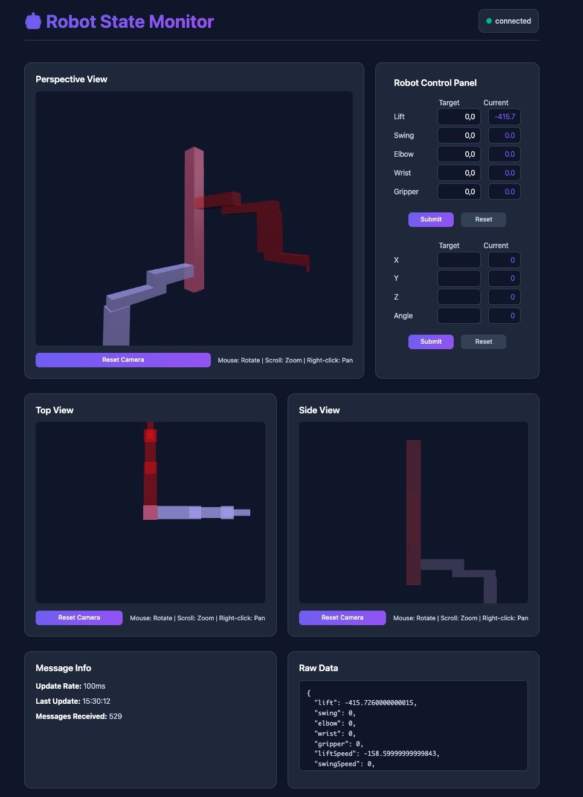

# Robot WebSocket State Monitor

A real-time Node.js that monitors and displays the state of a robot periodically transmitted over WebSocket.



## Installation

1. **Install Dependencies**:
   ```bash
   npm install
   ```

2. **Start the Server**:
   ```bash
   npm start
   ```
   
   Or for development with auto-restart:
   ```bash
   npm run dev
   ```

3. **Open in Browser**:
   Navigate to `http://localhost:3000`

## Browser Compatibility

- Modern browsers with WebSocket support
- Chrome 16+, Firefox 11+, Safari 7+, Edge 12+

## Node version

- I'm running v23.10.0, but should be compatible with older version from recent years
