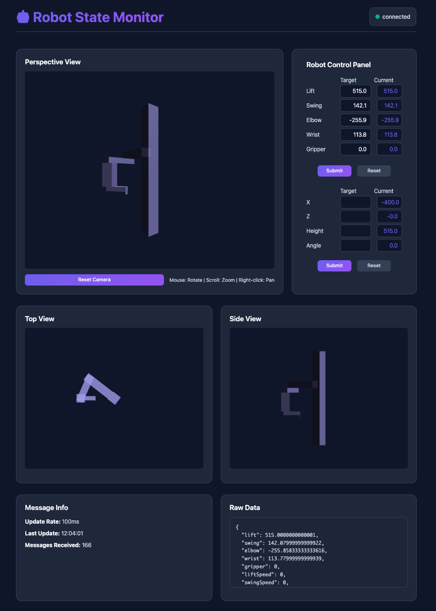

# Robot WebSocket State Monitor

A real-time Node.js that monitors and displays the state of a robot periodically transmitted over WebSocket.

I decided against using TypeScript or any frontend framework both as a challenge and to make this project easy to install, without any build process, lightweight and with simple dependencies. For a real-world application, I would use a more robust framework.



## To do

- Use HTTP for sending events to the backend
- Notify user when kinematic inversion is not possible (HTTP makes this easier)
- Notify user when sending of event is failed (HTTP makes this easier)
- Collision prevention
   - Check in advance the robot won't collide with the lift
   - Halt when parts are close to touching
   - Emergency stop button

- Input validation on frontend and backend, rx and tx
- Add Actuator object to make code less repetitive
- Add Configuration file for robot dimensions, max speeds, accelerations, etc.
- Movement is jerky, that might be fine and even better since it only shows state change that actually happened and ar most up to date


## Installation

1. **Install Dependencies**:
   ```bash
   npm install
   ```

2. **Start the Server**:
   ```bash
   npm start
   ```
   
   Or for development with auto-restart:
   ```bash
   npm run dev
   ```

3. **Open in Browser**:
   Navigate to `http://localhost:3000`

## Browser Compatibility

- Modern browsers with WebSocket support
- Chrome 16+, Firefox 11+, Safari 7+, Edge 12+

## Node version

- I'm running v23.10.0, but should be compatible with older version from recent years
